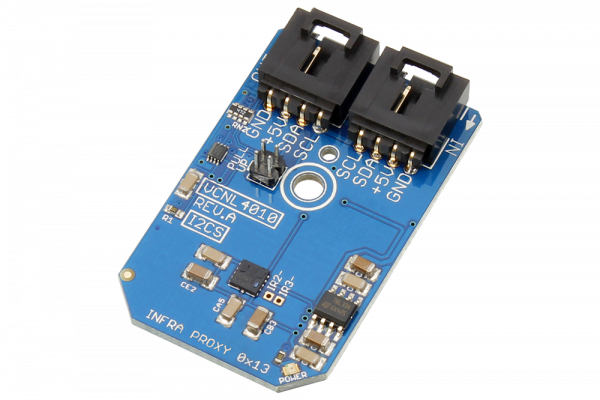

# VCNL4010

The VCNL4010 is a fully integrated proximity and ambient light sensor offering 16-bit resolution with an integrated signal processing IC, and features a standard I2C communication interface.The VCNL4010 can sense ambient light levels from 0.25 to 16K lux.
This Device is available from www.ncd.io 

[SKU: VCNL4010]

(https://store.ncd.io/product/vcnl4010-proximity-and-ambient-light-sensor-with-infrared-emitter-0-25-lux-to-16k-lux-i2c-mini-module/)
This Sample code can be used with Arduino.

Hardware needed to interface VCNL4010 sensor with Arduino

1. <a href="https://store.ncd.io/product/i2c-shield-for-arduino-nano/">Arduino Nano</a>

2. <a href="https://store.ncd.io/product/i2c-shield-for-arduino-micro-with-i2c-expansion-port/">Arduino Micro</a>

3. <a href="https://store.ncd.io/product/i2c-shield-for-arduino-uno/">Arduino uno</a>

4. <a href="https://store.ncd.io/product/dual-i2c-shield-for-arduino-due-with-modular-communications-interface/">Arduino Due</a>

5. <a href="https://store.ncd.io/product/vcnl4010-proximity-and-ambient-light-sensor-with-infrared-emitter-0-25-lux-to-16k-lux-i2c-mini-module//">VCNL4010 Proximity and Ambient Light Sensor with Infrared Emitter</a>

6. <a href="https://store.ncd.io/product/i%C2%B2c-cable/">I2C Cable</a>

VCNL4010:

The VCNL4010 is a fully integrated proximity and ambient light sensor offering 16-bit resolution with an integrated signal processing IC, and features a standard I2C communication interface.The VCNL4010 can sense ambient light levels from 0.25 to 16K lux.

Applications:

• Proximity/optical switch for consumer

• Computing

• Industrial devices

• Displays.

How to Use the VCNL4010 Arduino Library

The VCNL4010 has a number of settings, which can be configured based on user requirements.
          
1.Address calling:The following command is used to call the address of sensor to begin the transmission.

           vcnl.getAddr_VCNL4010(VCNL4010_DEFAULT_ADDRESS);           // 0x13
            
2.Frequency setting:The following command is used to set the frequency of sensor.

           vcnl.setFrequency(FREQUENCY_390_625KHZ);                    // 390.625 kHz (DEFAULT)
                   
